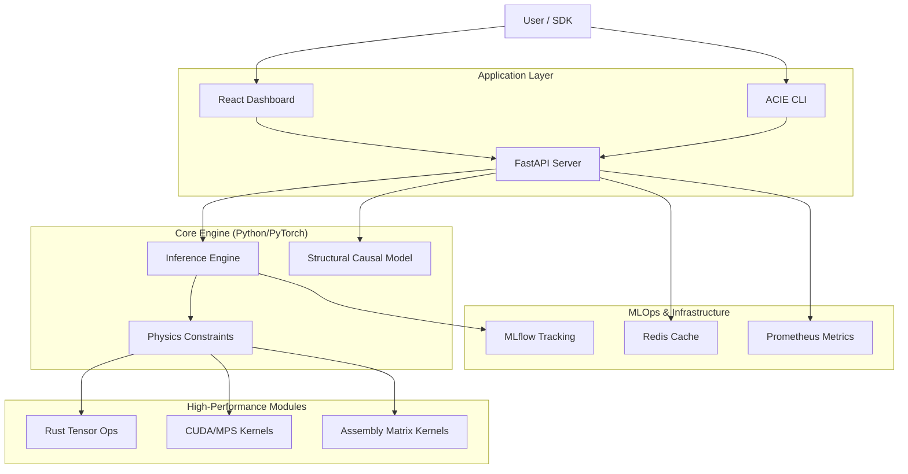

# ACIE - Astronomical Counterfactual Inference Engine 🌌

[](https://www.python.org/)
[](https://react.dev/)
[](https://fastapi.tiangolo.com/)
[](https://mlflow.org/)
[](https://www.rust-lang.org/)
[](LICENSE)

> 🚀 **A production-grade, multi-language, physics-constrained causal inference platform for astronomical observations.**

---

## 🌟 Overview

ACIE is an advanced deep learning system that performs **counterfactual inference** on astronomical data. Unlike traditional ML that predicts correlations, ACIE answers causal questions:

> *"What would this galaxy look like if its initial mass were 2x higher?"*

Now expanded into a **production platform**, ACIE features:
- **⚛️ Physics-Constrained Inference**: Enforces conservation laws via differentiable physics layers.
- **📊 Interactive Dashboard**: Real-time React-based UI for monitoring and inference.
- **🛠️ MLOps Pipeline**: Integrated MLflow tracking, model registry, and experiment management.
- **⚡ High-Performance**: GPU acceleration (CUDA/MPS), Rust tensor ops, and Assembly kernels.
- **🌐 Scalable Backend**: FastAPI server with Redis caching and Prometheus monitoring.

---

## ✨ Key Features

### 🧠 Core Inference
- **Causal Reasoning**: Structural Causal Models (SCM) with intervention operators `do(P=p*)`.
- **Counterfactuals**: 3-step Abduction-Action-Prediction pipeline.
- **Physics Engine**: Differentiable constraints for mass, energy, and momentum conservation.

### 💻 Developer Experience
- **Web Dashboard**: Live metrics, inference visualization, and system health monitoring.
- **Unified CLI**: Powerful `acie` command for training, inference, and MLOps.
- **Python SDK**: Client library for programmatic interaction.

### 🏭 MLOps & Production
- **Experiment Tracking**: Auto-logging of params, metrics, and artifacts via MLflow.
- **Model Registry**: Version control and stage management (Staging/Production).
- **Monitoring**: Real-time Prometheus metrics (latency, throughput, GPU usage).
- **Containerization**: Docker and Kubernetes support for scalable deployment.

---

## 🏗️ Architecture



---

## 🚀 Quick Start

### 1. Installation

```bash
# Clone repository
git clone https://github.com/Jitterx69/Project-ACIE-v1.git
cd Project-ACIE-v1

# Install dependencies
pip install -r requirements.txt
pip install -e .

# Install dashboard dependencies
cd frontend
npm install
cd ..
```

### 2. Launch the Platform

**Start the Backend API:**
```bash
python acie/api/fastapi_server.py
# Running at http://localhost:8080
```

**Start the Dashboard:**
```bash
cd frontend
npm run dev
# Running at http://localhost:5173
```

### 3. CLI Usage

**Train a Model:**
```bash
acie train --dataset-size 10k --epochs 50 --experiment-name "baseline-v1"
```

**Run Inference:**
```bash
acie infer --observation "data/obs_01.csv" --intervention "mass=1.5"
```

**Manage Models:**
```bash
acie models list
acie models promote --version 1 --stage "Production"
```

---

## 📂 Project Structure

```
ACIE/
├── acie/                  # Python Core Package
│   ├── api/               # FastAPI Server
│   ├── cli.py             # Unified CLI Tool
│   ├── core/              # SCM & Inference Engine
│   ├── dashboard/         # Dashboard Data Providers
│   ├── monitoring/        # Prometheus Metrics
│   ├── sdk/               # Python Client SDK
│   └── tracking/          # MLOps (MLflow)
├── frontend/              # React Web Dashboard
│   ├── src/               # UI Components
│   └── public/            # Static Assets
├── rust/                  # Rust Performance Modules
├── asm/                   # Assembly Kernels
├── java/                  # Legacy Java Components
├── k8s/                   # Kubernetes Manifests
├── docker/                # Docker Configuration
├── scripts/               # Utility Scripts
└── tests/                 # Test Suite
```

---

## 🔧 MLOps Workflow

ACIE integrates standard MLOps practices:

1.  **Track**: Run `acie train`. Metrics and params are logged to MLflow.
2.  **Register**: Best models are registered to the Model Registry.
3.  **Evaluate**: `acie evaluate` benchmarks performance on test sets.
4.  **Promote**: Use `acie models promote` to move models to Production.
5.  **Deploy**: The API server automatically serves the "Production" model.

---

## 📦 Datasets

Access large-scale synthetic astronomical datasets:
- **Observational**: 10k/20k samples of galaxy spectra/photometry.
- **Interventional**: Paired data with specific physical interventions.
- **Counterfactual**: Ground truth counterfactual outcomes.

[Download Datasets (Google Drive)](https://drive.google.com/drive/folders/19axWZDvMbTpHdN8KRrOIuzCYcYxn_9df?usp=drive_link)

---

## 🤝 Contributing

1. Fork the repo
2. Create feature branch (`git checkout -b feature/NewPhysics`)
3. Commit changes (`git commit -m 'Add thermodynamic constraints'`)
4. Push to branch (`git push origin feature/NewPhysics`)
5. Open a Pull Request

---

## 📄 License

MIT License. See [LICENSE](LICENSE) for details.

---

<div align="center">
  <b>Built with ❤️ by the ACIE Team</b><br>
  Python • React • Rust • Assembly • CUDA
</div>
