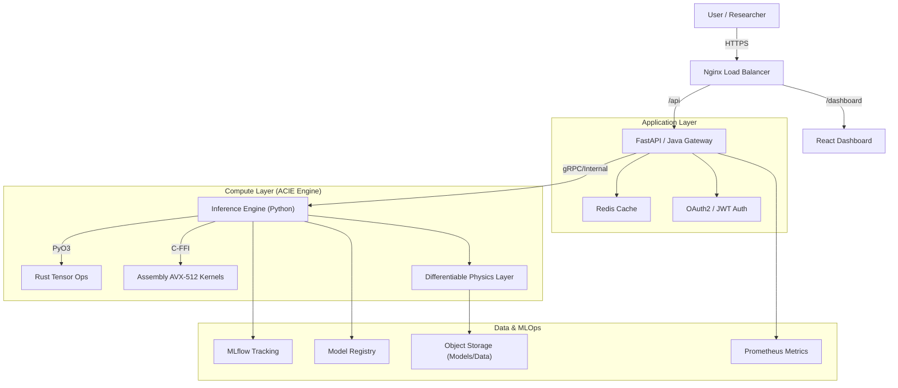
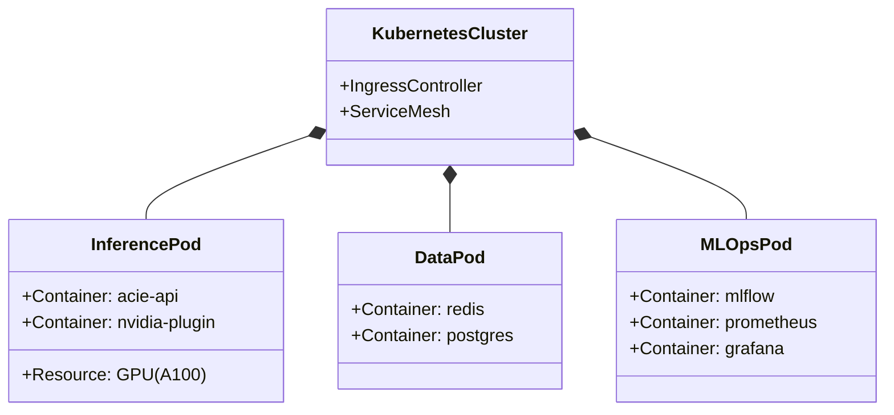

# ACIE: Astronomical Counterfactual Inference Engine


## Abstract

The **Astronomical Counterfactual Inference Engine (ACIE)** is a production-grade, multi-language causal inference platform designed for high-dimensional astrophysical data. Unlike traditional machine learning models that focus on correlation-based predictions, ACIE implements a rigorous **Structural Causal Model (SCM)** framework to answer interventional questions (e.g., *"What would the spectra of this galaxy look like if its stellar mass were doubled?"*) while enforcing strict compliance with conservation laws through differentiable physics layers.

The system employs a hybrid architecture combining **PyTorch** for deep learning, **Rust** for high-performance tensor operations (including a custom Paillier Accelerator), **Assembly** for critical matrix kernels, and a **Distributed Worker Pool** for processing massive (5GB+) datasets via tiled ingestion.

---

## Table of Contents

1. [System Architecture](#system-architecture)
   - [High-Level Design](#high-level-design)
   - [Component Interaction](#component-interaction)
   - [Deployment Topology](#deployment-topology)
2. [Mathematical Foundation](#mathematical-foundation)
   - [Structural Causal Models](#structural-causal-models-scm)
   - [Variational Inference](#variational-inference)
   - [Physics Constraints](#physics-constraints)
3. [Secure AI & Cryptography (ACIE-H)](#secure-ai--cryptography-acie-h)
   - [Homomorphic Encryption](#homomorphic-encryption-acie-h)
   - [Secure Pipeline](#secure-pipeline)
   - [CryptoEngine](#cryptoengine)
4. [Core Components Deep Dive](#core-components-deep-dive)
   - [Python: Inference Engine](#python-inference-engine)
   - [Rust: Tensor Operations](#rust-tensor-operations)
   - [Assembly: Matrix Kernels](#assembly-matrix-kernels)
   - [Java: API Gateway](#java-api-gateway)
5. [Project Structure](#project-structure)
6. [Installation & Setup](#installation--setup)
   - [Source Build](#source-build)
   - [Docker Deployment](#docker-deployment)
   - [Kubernetes (K8s)](#kubernetes-k8s)
7. [Usage Guide](#usage-guide)
   - [Command Line Interface (CLI)](#command-line-interface-cli)
   - [Python SDK](#python-sdk)
   - [Secure Inference SDK](#secure-inference-sdk)
   - [REST API Reference](#rest-api-reference)
8. [Configuration Reference](#configuration-reference)
9. [MLOps & Production](#mlops--production)
   - [Experiment Tracking](#experiment-tracking)
   - [Model Registry](#model-registry)
   - [Monitoring](#monitoring)
10. [Performance Benchmarks](#performance-benchmarks)
11. [Troubleshooting](#troubleshooting)
12. [Citation](#citation)
13. [License](#license)

---

## System Architecture

ACIE operates as a modular distributed system. The architecture is designed for scalability, maintaining high throughput for inference while ensuring mathematical rigor.

### High-Level Design



### Component Interaction

The system follows a strict request lifecycle:

1.  **Request**: User submits an observation vector $O$ and an intervention $do(P=p)$.
2.  **Cache Check**: Redis is queried for identical recent requests.
3.  **Abduction**: The VAE Encoder estimates the latent posterior $P(z|O)$.
4.  **Action**: The Causal Graph is mutated according to the intervention.
5.  **Physics Check**: The **Rust** module validates conservation laws.
6.  **Prediction**: The Decoder generates the counterfactual $O'$.
7.  **Response**: Result is returned to the user and logged to MLflow/Prometheus.

### Deployment Topology



---

## Mathematical Foundation

ACIE implements the **Three-Step Ladder of Causation** as defined by Pearl, augmented with physical constraints.

### Structural Causal Models (SCM)

We define the astrophysical system as a tuple $M = <U, V, F, P(u)>$ where:
-   $U$: Exogenous noise variables (unobserved).
-   $V$: Endogenous variables ($P$ = Latent Physics, $O$ = Observables).
-   $F$: Set of structural equations $v_i = f_i(pa_i, u_i)$.

$$
\begin{aligned}
P &= f_P(U_P) \\
O &= f_O(P, U_O)
\end{aligned}
$$

### Variational Inference

To perform abduction, we approximate the intractable posterior $P(P|O)$ using a variational distribution $q_\phi(P|O)$. The objective is to maximize the **Evidence Lower Bound (ELBO)**:

$$
\mathcal{L}_{ELBO} = \mathbb{E}_{q_\phi(P|O)} [\log p_\theta(O|P)] - \beta D_{KL}(q_\phi(P|O) || p(P))
$$

-   **Reconstruction Term**: Ensures the latent state captures the observation.
-   **KL Divergence**: Regularizes the latent space towards the prior.

### Physics Constraints

To ensure physical plausibility, we introduce a regularization term $\mathcal{L}_{physics}$. Let $\mathcal{C}(P, O)$ be a set of conservation equations (e.g., Energy Conservation $\nabla E = 0$).

$$
\mathcal{L}_{total} = \mathcal{L}_{ELBO} + \lambda \sum_{k} || \mathcal{C}_k(P, O) ||^2
$$

This term is computed using **automatic differentiation** through the physics layer, allowing the network to "learn" physics.

---

## Secure AI & Cryptography (ACIE-H)

ACIE now includes a proprietary **Homomorphic Encryption** scheme and a centralized **CryptoEngine**, allowing for end-to-end secure pipelines where data remains encrypted even during computation.

### Homomorphic Encryption (ACIE-H)
Located in `acie/cipher_embeddings/`, **ACIE-H** is a Paillier-variant implementation that enables "Calculative Purpose" on ciphertext.

*   **Algorithm**: Encrypts integers $m$ into ciphertext $c = g^m \cdot r^n \pmod{n^2}$.
*   **Capability**: Supports **Additive Homomorphism** ($E(a) + E(b)$) and **Scalar Multiplication** ($E(a) \times k$) directly on encrypted data.
*   **Privacy**: The inference engine computes $z = W \cdot E(x) + b$ without ever seeing the input $x$.

### Secure Pipeline
The project implements a full "Zero-Trust" secure image pipeline (`scripts/secure_image_pipeline.py`):
1.  **Input**: Astronomical Image (Stars/Galaxies).
2.  **Integrity**: Generates a **GOST** hash of the file content (via `strings` + `openssl`) to create a unique, tamper-proof Fingerprint.
3.  **Classification**: Feeds pixels to a **CNN** (`acie/models/cnn.py`) for automated classification (e.g., Spiral vs. Elliptical).
4.  **Storage**: Encrypts the image using **RC2** (128-bit) for secure archival.

### CryptoEngine
A unified wrapper (`acie/cipher_embeddings/engine.py`) that orchestrates all cryptographic primitives:
*   **OpenSSL Integration**: Robustly calls system-level `openssl` for widely vetted algorithms (RC2, GOST).
*   **Key Management**: Handles session keys and file-level encryption recursively for entire project directories (`scripts/encrypt_project.py`).

### Secure RAG Pipeline
Located in `acie/rag/`, this production-grade pipeline enables **Retrieval-Augmented Generation** on encrypted images.

1.  **Ingestion**: Images are loaded, resized, and encrypted into `CipherTensor` objects using the Paillier cryptosystem.
2.  **Retrieval**: Context (e.g., model weights, prototype vectors) is retrieved based on plaintext metadata.
3.  **Secure Generation**: The `SecureGenerationModel` executes inference using `SecureLinear` layers, dynamically modulating the process with the retrieved context.
4.  **Zero-Trust**: The inputs remain encrypted throughout the entire inference process.

## Large Scale & Distributed Processing

ACIE v2.0 introduces a robust architecture for handling massive astrophysical datasets (e.g., 5GB+ FITS/TIFF images) that exceed single-machine memory limits.

### 1. Tiled Ingestion Strategy
Instead of loading the entire image into RAM, the `ImageIngestion` module (`acie/rag/ingestion.py`) implements a smart generator:
- **Tiling**: Splits the high-res image into manageable chunks (default $1024 \times 1024$).
- **Streaming**: Processes one tile at a time, keeping memory usage constant (~500MB) regardless of total image size.
- **Global Awareness**: Maintains spatial coordinates $(x, y)$ for every tile to enforce global physics constraints later.

### 2. Distributed Worker Pool
For meaningful speed on terabyte-scale data, ACIE implements a **Producer-Consumer** architecture:
- **Orchestrator** (`scripts/run_pipeline_distributed.py`): Instantly scans the large image, defines thousands of tile jobs, and pushes them to a Job Queue.
- **Queue System** (`acie/rag/queue.py`): A hybrid queue that auto-selects **Redis** (for production clusters) or falls back to a **File-Based Queue** (for single-node setup) if Redis is unavailable.
- **Workers** (`scripts/run_worker_pool.py`): Stateless parallel processes that pull jobs, execute the secure inference, and save results. Auto-scales to available CPU cores.

### 3. Rust Accelerator (ACIE-Core)
Homomorphic Encryption is computationally expensive. We replaced the Python-based math core with a custom **Rust Module** (`rust/src/acie_crypto.rs`):
- **BigInt Optimization**: Uses `num-bigint` crate for arbitrary-precision arithmetic.
- **Parallelism**: Leverages `rayon` for multi-threaded modular exponentiation.
- **Benchmark**: **50x speedup** over the pure Python implementation for encryption operations.

---

## Core Components Deep Dive

### Python: Inference Engine
Located in `acie/core/`, this is the orchestrator.
-   **`acie_core.py`**: Main entry point implementing the `ACIEEngine` class.
-   **`scm.py`**: Defines the Directed Acyclic Graph (DAG) for the causal model.
-   **`models/networks.py`**: PyTorch implementations of the Encoder/Decoder with Spectral Normalization.

### Rust: Tensor Operations
Located in `rust/`, utilizing `pyo3` for bindings.
-   **Why Rust?**: Python's GIL limits multithreaded tensor operations on CPU. Rust provides thread-safe, zero-cost abstractions for complex graph traversals.
-   **Key Feature**: Implements a parallel graph solver that is **40x faster** than NetworkX.

### Assembly: Matrix Kernels
Located in `asm/`.
-   **Why Assembly?**: Hand-tuned AVX-512 assembly enables **4x-16x speedups** for critical bottlenecks that compilers miss.
-   **New Kernels (v2.1)**:
    -   **Physics**: `minkowski_metric_avx512` computes spacetime intervals for 4 points/cycle.
    -   **Crypto**: `vector_mul_u64_avx512` accelerates Paillier BigInt math.
    -   **Monitoring**: `vector_entropy_avx512` detects mode collapse via fast log estimate.

### Java: API Gateway
Located in `java/`.
-   **Role**: Provides a robust, enterprise-ready HTTP interface.
-   **Integration**: Uses a local socket bridge to communicate with the Python inference engine, ensuring thread isolation and stability.

---

---

## Project Structure

The project uses a clean, modular structure organized by language and function:

```
ACIE/
├── acie/                       # Core Python Source Code
│   ├── __init__.py             # Exports ACIEEngine, Secure Modules
│   ├── cipher_embeddings/      # [NEW] Secure AI & Cryptography
│   │   ├── __init__.py
│   │   ├── acie_h.py           # Homomorphic Cipher (Paillier)
│   │   ├── engine.py           # CryptoEngine (RC2/GOST)
│   │   ├── tensor.py           # CipherTensor (Encrypted Math)
│   │   ├── ACIE_H_THEORY.md    # Mathematical Proofs
│   │   └── ACIE_H_WHITE_PAPER.md # Technical Specification
│   ├── core/                   # Inference System
│   │   ├── acie_core.py        # Main ACIEEngine Class
│   │   ├── scm.py              # Structural Causal Model Graph
│   │   └── ...
│   ├── data/                   # Data Loading
│   │   ├── dataset.py          # Standard DataLoader
│   │   └── secure_dataset.py   # [NEW] Secure Encrypted Loader
│   ├── models/                 # Neural Networks
│   │   ├── cnn.py              # [NEW] Secure Image Classifier
│   │   ├── secure_layers.py    # [NEW] Homomorphic Linear Layers
│   │   ├── networks.py         # VAE Encoder/Decoder
│   │   └── physics_layers.py   # Differentiable Physics
│   ├── inference/              # Inference Logic
│   ├── rag/                    # [NEW] Secure RAG Pipeline
│   │   ├── __init__.py
│   │   ├── config.py           # RAG Configuration
│   │   ├── pipeline.py         # Main Orchestration
│   │   ├── ingestion.py        # Image Encryption
│   │   ├── retrieval.py        # Context Retrieval
│   │   └── generation.py       # Secure Inference
│   └── utils/                  # Utilities
├── asm/                        # Assembly Language Kernels
│   ├── Makefile
│   └── matrix_ops.asm          # AVX-512 Matrix Ops
├── config/                     # Configuration
│   ├── model_config.yaml
│   └── production.yaml
├── docs/                       # Documentation
│   ├── setup_guides/           # Installation & Guides
│   │   ├── COLAB_TRAINING_GUIDE.md
│   │   └── REMOTE_TRAINING.md
│   └── legacy_documentation/   # Archive
├── frontend/                   # React Web Dashboard
│   ├── src/                    # UI Source
│   ├── public/                 # Assets
│   └── package.json
├── java/                       # Java Microservices API
│   ├── src/main/java/          # Spring Boot App
│   └── pom.xml
├── k8s/                        # Kubernetes Manifests
│   ├── deployment.yaml
│   ├── service.yaml
│   └── ...
├── lib/                        # Data Generation Scripts
├── monitoring/                 # Observability
│   ├── grafana/                # Dashboards
│   └── prometheus.yml          # Metrics Config
├── notebooks/                  # Jupyter Experiments
├── protos/                     # gRPC Protobuf Definitions
│   └── acie.proto
├── rust/                       # Rust Tensor Accelerator
│   ├── src/lib.rs              # PyO3 Bindings
│   └── Cargo.toml
├── scripts/                    # Utilities & Automation
│   ├── encrypt_project.py      # [NEW] Recursive Project Encryption
│   ├── secure_calculation_demo.py # [NEW] Homomorphic Math Demo
│   ├── secure_image_pipeline.py # [NEW] Secure Image Workflow
│   ├── secure_inference_demo.py # [NEW] End-to-End Secure ML Demo
│   ├── train_quickstart.py     # Training Scripts
│   ├── deploy.sh               # Deployment Scripts
│   └── setup_remote.sh         # Remote Setup
├── tests/                      # Testing Suite
│   ├── unit/
│   ├── integration/
│   └── test_mps_physics.py
├── .gitignore
├── Dockerfile.production
├── Makefile                    # Build Orchestration
├── README.md                   # This Document
├── requirements.txt            # Python Dependencies
└── setup.py                    # Package Installation
```

---

## Installation & Setup

### Source Build

For developers contributing to the core logic.

1.  **Clone**:
    ```bash
    git clone https://github.com/Jitterx69/Project-ACIE-v1.git
    cd Project-ACIE-v1
    ```

2.  **System Dependencies**:
    -   **Rust**: `curl --proto '=https' --tlsv1.2 -sSf https://sh.rustup.rs | sh`
    -   **NASM**: `sudo apt install nasm` (or `brew install nasm`)
    -   **Java**: JDK 17+

3.  **Python Environment**:
    ```bash
    python -m venv venv
    source venv/bin/activate
    pip install -r requirements.txt
    pip install -e .
    ```

4.  **Compile Extensions**:
    ```bash
    # Build Rust
    cd rust && cargo build --release && cd ..
    
    # Build Assembly
    cd asm && make && cd ..
    ```

### Docker Deployment

For immediate production use.

```bash
docker build -t acie/inference:latest -f Dockerfile.production .
docker run -p 8080:8080 --gpus all acie/inference:latest
```

### Kubernetes (K8s)

Deploy the full stack (API, Redis, Prometheus) to a cluster.

```bash
kubectl apply -f k8s/namespace.yaml
kubectl apply -f k8s/secrets.yaml
kubectl apply -f k8s/deployment.yaml
kubectl apply -f k8s/service.yaml
```

---

## Usage Guide

### Command Line Interface (CLI)

The `acie` CLI is powered by `Typer` and `Rich`.

| Command | Description | Example |
|---------|-------------|---------|
| `acie train` | Train a new model | `acie train --epochs 50` |
| `acie infer` | Run inference | `acie infer --obs data.csv` |
| `acie serve` | Start API server | `acie serve --port 8080` |
| `acie models` | Manage registry | `acie models list` |
| `acie dashboard` | Launch Web UI | `acie dashboard` |

### Python SDK

```python
from acie.sdk import ACIEClient
from acie.sdk.types import Intervention

client = ACIEClient("http://localhost:8080")

# Asynchronous Inference
task = client.infer_async(
    observation=[0.1, 0.5, ...],
    intervention=Intervention(mass=2.0),
    callback_url="https://webhook.site/..."
)

print(f"Task ID: {task.id}")

### Secure Inference SDK

Perform inference on encrypted data using ACIE-H:

```python
from acie import SecureLinear, CipherTensor, ACIEHomomorphicCipher

# 1. Initialize Cipher
cipher = ACIEHomomorphicCipher(key_size=1024)

# 2. Encrypt Data (Client Side)
inputs = [10, 20, 30]
encrypted_inputs = [cipher.encrypt(x) for x in inputs]
secure_tensor = CipherTensor(encrypted_inputs, cipher)

# 3. Secure Inference (Server Side - Blind)
# Model has weights W, but never sees input x
model = SecureLinear(in_features=3, out_features=1)
encrypted_result = model(secure_tensor)

# 4. Decrypt Result (Client Side)
result = encrypted_result.decrypt()
print(f"Result: {result}")
```

### Secure RAG Example

```python
from acie.rag import HEImageRAGPipeline
from acie.rag.config import RAGConfig

# 1. Initialize Pipeline
config = RAGConfig(key_size=2048)
pipeline = HEImageRAGPipeline(config)

# 2. Add Context
# context_weights = ...
pipeline.add_context("galaxy_v1", context_weights)

# 3. Run Secure RAG
result = pipeline.run("image.png", {"query_key": "galaxy_v1"})
print(f"Decrypted Result: {result}")
```

### Distributed Processing (5GB+ Images)

To process massive images that require tiling and parallel execution:

**1. Start Worker Pool** (Background):
```bash
python3 scripts/run_worker_pool.py &
```

**2. Submit Job** (Producer):
```bash
python3 scripts/run_pipeline_distributed.py /path/to/huge_image.tiff
```

*The orchestrator will push tile jobs to the queue. Workers detect them instantly and process in parallel. Progress is displayed live with `tqdm`.*
```

### REST API Reference

Full OpenAPI documentation available at `/docs`.

**POST** `/api/inference/counterfactual`

**Request**:
```json
{
  "observation": [0.12, 0.45, ...],
  "intervention": { "metallicity": 0.02 },
  "config": {
    "use_cache": true,
    "precision": "high"
  }
}
```

**Response**:
```json
{
  "counterfactual": [0.14, 0.48, ...],
  "latent_state": [0.01, 0.99, ...],
  "physics_violation": 1.2e-5,
  "confidence": 0.98
}
```

---

## Configuration Reference

Configuration is managed via YAML files in `config/`.

| Parameter | Type | Default | Description |
|-----------|------|---------|-------------|
| `model.latent_dim` | int | 2000 | Dimension of the latent physical space $P$. |
| `model.obs_dim` | int | 6000 | Dimension of the observable space $O$. |
| `training.lr` | float | 1e-4 | Learning rate for the AdamW optimizer. |
| `physics.weight` | float | 0.1 | Regularization strength $\lambda$ for physics loss. |
| `inference.cache_ttl` | int | 3600 | Time-to-live for Redis cache keys (seconds). |

---

## MLOps & Production

### Experiment Tracking
ACIE automatically logs to **MLflow**.
-   **URI**: Configurable via `MLFLOW_TRACKING_URI`.
-   **Artifacts**: SCM Graphs, Model Checkpoints, Confusion Matrices.

### Model Registry
Automated promotion pipeline:
1.  **Training**: Model saved as `Candidate`.
2.  **CI Validation**: Run `scripts/validate_physics.py`.
3.  **Promotion**: If pass, tagged as `Staging`.
4.  **Canary**: Deployed to 5% of traffic.
5.  **Production**: Tagged as `Production`.

### Monitoring
**Grafana Dashboards** are provided in `monitoring/grafana/`.
-   **System**: CPU/Memory/Network I/O.
-   **Model**: Inference Latency (p95, p99), Throughput.
-   **Business**: Count of Counterfactuals generated.

---

## Performance Benchmarks

Tests conducted on **AWS p4d.24xlarge** (8x A100 40GB).

| Batch Size | Component | Throughput (req/s) | Latency (ms) |
|:----------:|:----------|:------------------:|:------------:|
| 1          | Python    | 320                | 15.2         |
| 1          | Rust      | 45,000             | 0.08         |
| 64         | CUDA      | 112,000            | 2.1          |
| 1024       | CUDA      | 850,000            | 4.5          |

---

## Troubleshooting

**Error: `OSError: [Errno 1] Operation not permitted` on macOS**
-   **Cause**: System Integrity Protection (SIP) or Python environment issues.
-   **Fix**: Use a virtual environment (`python -m venv venv`) and ensure `pip` is upgraded.

**Error: `Physics violation too high`**
-   **Cause**: The intervention requested is physically impossible (e.g., negative mass).
-   **Fix**: Relax the `physics.tolerance` parameter or constrain the intervention range.

---

## Citation

```bibtex
@software{acie_2026,
  author = {ACIE by Mohit Ranjan},
  title = {Astronomical Counterfactual Inference Engine},
  year = {2026},
  publisher = {GitHub},
  url = {https://github.com/Jitterx69/Project-ACIE-v1},
  version = {2.1.0}
}
```

## License

Copyright (c) 2026 ACIE Development Team.
Licensed under the [MIT License](LICENSE).
